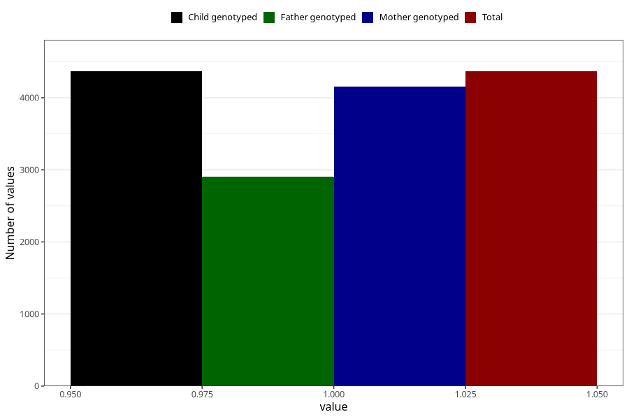

# pregnancy_itch_after_29w
Variable mapping to `CC428` in `Skjema3_v12`.
- Number of values:

| Value | Total | Child genotyped | Mother genotyped | Father genotyped |
| ----- | ----- | --------------- | ---------------- | ---------------- |
| Missing | 76639 | 76639 | 72463 | 50701 |
| Non-missing | 4366 | 4366 | 4154 | 2903 |
| 1 | 4366 | 4366 | 4154 | 2903 |

