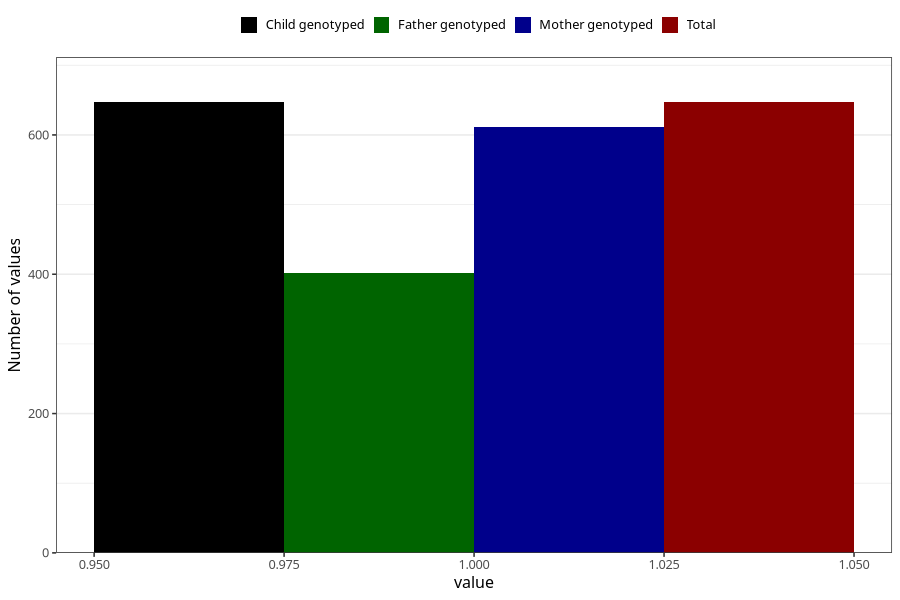

# pregnancy_itch_before_4w
Variable mapping to `AA256` in `Skjema1_v12`.
- Number of values:

| Value | Total | Child genotyped | Mother genotyped | Father genotyped |
| ----- | ----- | --------------- | ---------------- | ---------------- |
| Missing | 80358 | 80358 | 76006 | 53202 |
| Non-missing | 647 | 647 | 611 | 402 |
| 1 | 647 | 647 | 611 | 402 |

