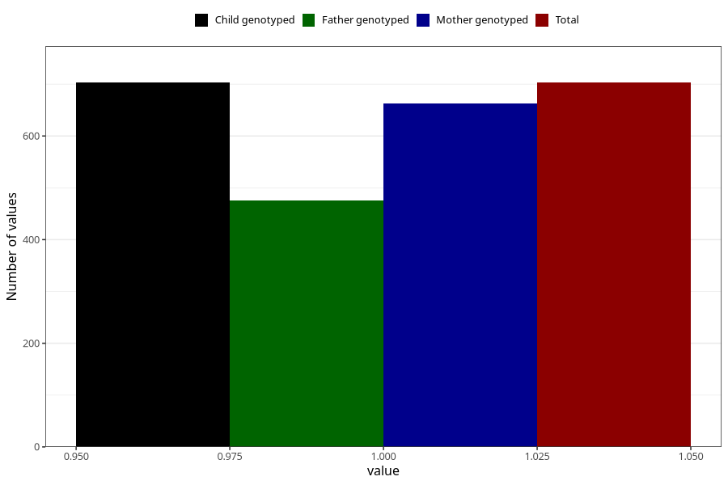

# protein_in_urine_5w_8w
Variable mapping to `AA407` in `Skjema1_v12`.
- Number of values:

| Value | Total | Child genotyped | Mother genotyped | Father genotyped |
| ----- | ----- | --------------- | ---------------- | ---------------- |
| Missing | 80302 | 80302 | 75955 | 53128 |
| Non-missing | 703 | 703 | 662 | 476 |
| 1 | 703 | 703 | 662 | 476 |

