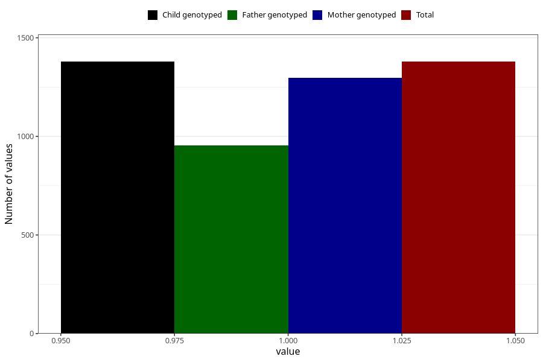

# protein_in_urine_9w_12w
Variable mapping to `AA408` in `Skjema1_v12`.
- Number of values:

| Value | Total | Child genotyped | Mother genotyped | Father genotyped |
| ----- | ----- | --------------- | ---------------- | ---------------- |
| Missing | 79626 | 79626 | 75321 | 52649 |
| Non-missing | 1379 | 1379 | 1296 | 955 |
| 1 | 1379 | 1379 | 1296 | 955 |

