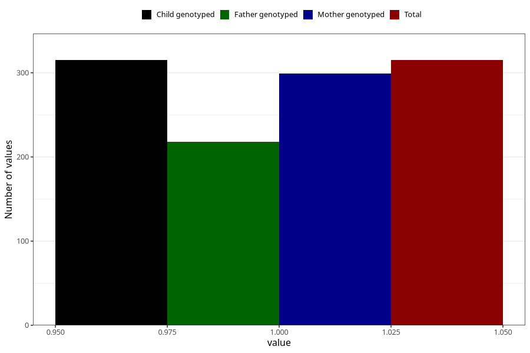

# protein_in_urine_before_4w
Variable mapping to `AA406` in `Skjema1_v12`.
- Number of values:

| Value | Total | Child genotyped | Mother genotyped | Father genotyped |
| ----- | ----- | --------------- | ---------------- | ---------------- |
| Missing | 80690 | 80690 | 76318 | 53386 |
| Non-missing | 315 | 315 | 299 | 218 |
| 1 | 315 | 315 | 299 | 218 |

