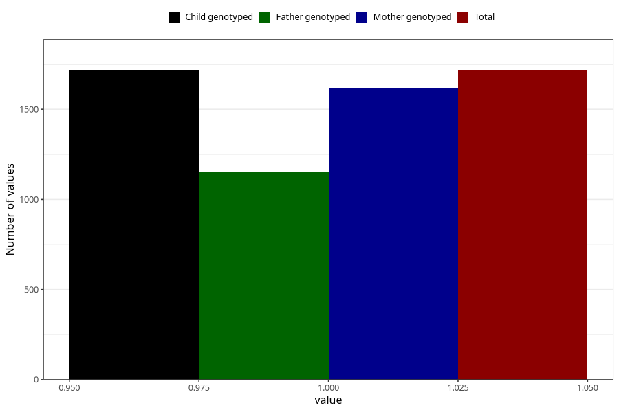

# sinusitis_ear_infection_13w_15w
Variable mapping to `AA369` in `Skjema1_v12`.
- Number of values:

| Value | Total | Child genotyped | Mother genotyped | Father genotyped |
| ----- | ----- | --------------- | ---------------- | ---------------- |
| Missing | 79288 | 79288 | 74997 | 52455 |
| Non-missing | 1717 | 1717 | 1620 | 1149 |
| 1 | 1717 | 1717 | 1620 | 1149 |

