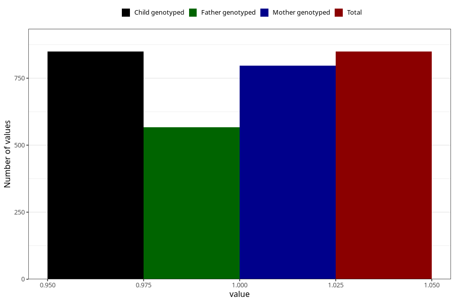

# sinusitis_ear_infection_5w_8w
Variable mapping to `AA367` in `Skjema1_v12`.
- Number of values:

| Value | Total | Child genotyped | Mother genotyped | Father genotyped |
| ----- | ----- | --------------- | ---------------- | ---------------- |
| Missing | 80156 | 80156 | 75820 | 53037 |
| Non-missing | 849 | 849 | 797 | 567 |
| 1 | 849 | 849 | 797 | 567 |

