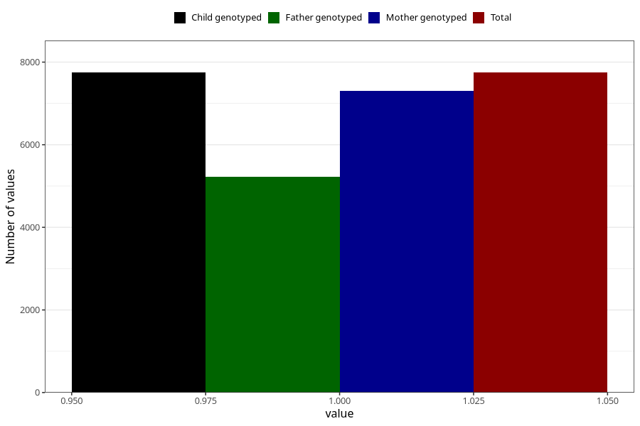

# sleeping_problems_13w_15w
Variable mapping to `AA299` in `Skjema1_v12`.
- Number of values:

| Value | Total | Child genotyped | Mother genotyped | Father genotyped |
| ----- | ----- | --------------- | ---------------- | ---------------- |
| Missing | 73258 | 73258 | 69316 | 48386 |
| Non-missing | 7747 | 7747 | 7301 | 5218 |
| 1 | 7747 | 7747 | 7301 | 5218 |

