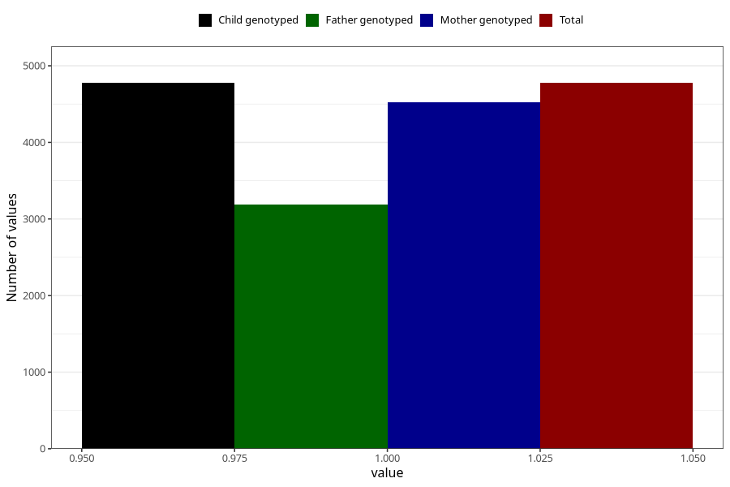

# sleeping_problems_5w_8w
Variable mapping to `AA297` in `Skjema1_v12`.
- Number of values:

| Value | Total | Child genotyped | Mother genotyped | Father genotyped |
| ----- | ----- | --------------- | ---------------- | ---------------- |
| Missing | 76229 | 76229 | 72088 | 50416 |
| Non-missing | 4776 | 4776 | 4529 | 3188 |
| 1 | 4776 | 4776 | 4529 | 3188 |

