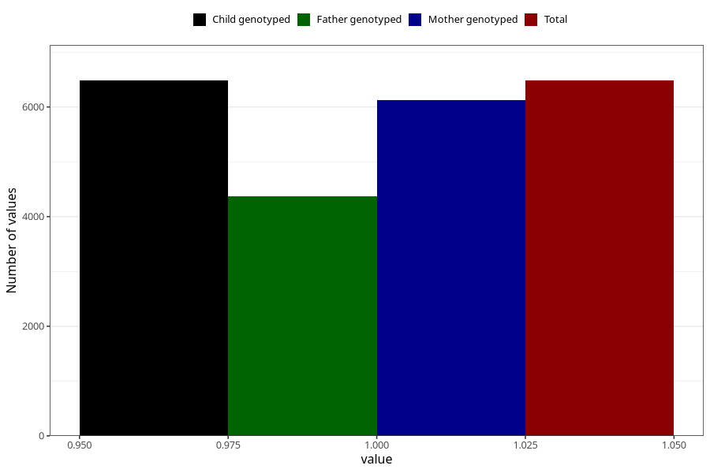

# sleeping_problems_9w_12w
Variable mapping to `AA298` in `Skjema1_v12`.
- Number of values:

| Value | Total | Child genotyped | Mother genotyped | Father genotyped |
| ----- | ----- | --------------- | ---------------- | ---------------- |
| Missing | 74523 | 74523 | 70497 | 49230 |
| Non-missing | 6482 | 6482 | 6120 | 4374 |
| 1 | 6482 | 6482 | 6120 | 4374 |

