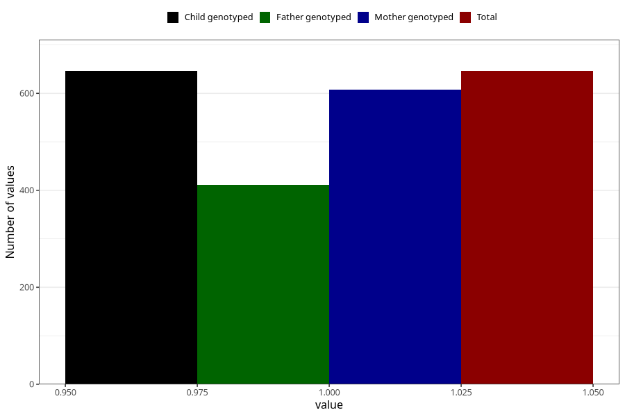

# sugar_in_urine_13w_15w
Variable mapping to `AA399` in `Skjema1_v12`.
- Number of values:

| Value | Total | Child genotyped | Mother genotyped | Father genotyped |
| ----- | ----- | --------------- | ---------------- | ---------------- |
| Missing | 80359 | 80359 | 76009 | 53193 |
| Non-missing | 646 | 646 | 608 | 411 |
| 1 | 646 | 646 | 608 | 411 |

