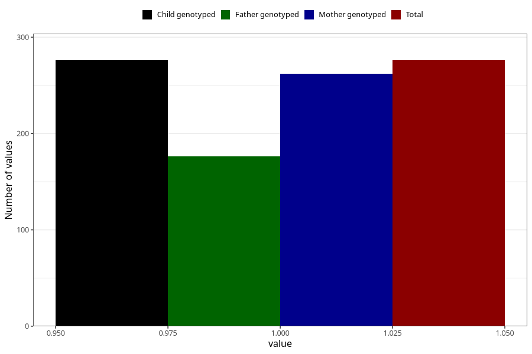

# sugar_in_urine_5w_8w
Variable mapping to `AA397` in `Skjema1_v12`.
- Number of values:

| Value | Total | Child genotyped | Mother genotyped | Father genotyped |
| ----- | ----- | --------------- | ---------------- | ---------------- |
| Missing | 80729 | 80729 | 76355 | 53428 |
| Non-missing | 276 | 276 | 262 | 176 |
| 1 | 276 | 276 | 262 | 176 |

