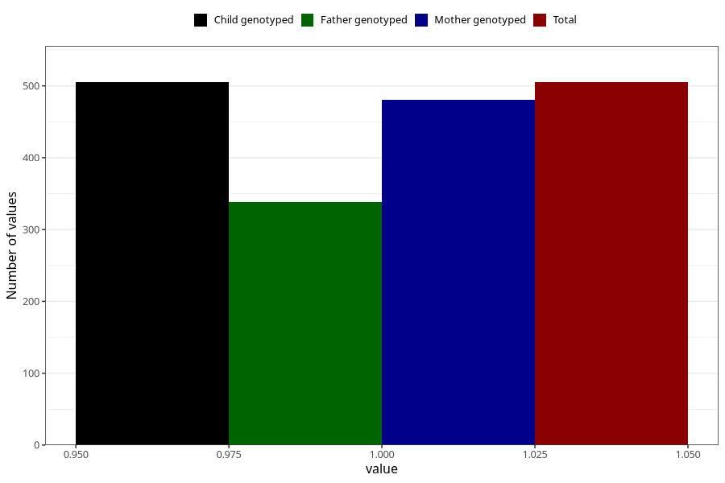

# sugar_in_urine_9w_12w
Variable mapping to `AA398` in `Skjema1_v12`.
- Number of values:

| Value | Total | Child genotyped | Mother genotyped | Father genotyped |
| ----- | ----- | --------------- | ---------------- | ---------------- |
| Missing | 80500 | 80500 | 76136 | 53266 |
| Non-missing | 505 | 505 | 481 | 338 |
| 1 | 505 | 505 | 481 | 338 |

