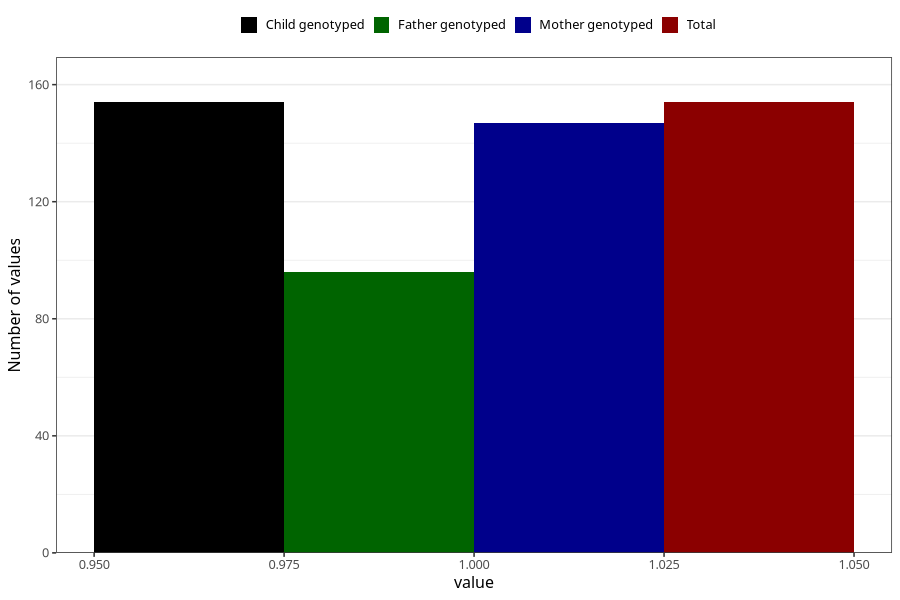

# sugar_in_urine_before_4w
Variable mapping to `AA396` in `Skjema1_v12`.
- Number of values:

| Value | Total | Child genotyped | Mother genotyped | Father genotyped |
| ----- | ----- | --------------- | ---------------- | ---------------- |
| Missing | 80851 | 80851 | 76470 | 53508 |
| Non-missing | 154 | 154 | 147 | 96 |
| 1 | 154 | 154 | 147 | 96 |

