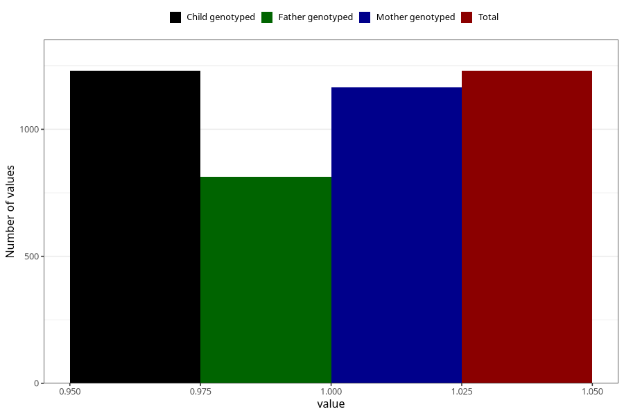

# throat_infection_13w_15w
Variable mapping to `AA359` in `Skjema1_v12`.
- Number of values:

| Value | Total | Child genotyped | Mother genotyped | Father genotyped |
| ----- | ----- | --------------- | ---------------- | ---------------- |
| Missing | 79775 | 79775 | 75451 | 52792 |
| Non-missing | 1230 | 1230 | 1166 | 812 |
| 1 | 1230 | 1230 | 1166 | 812 |

