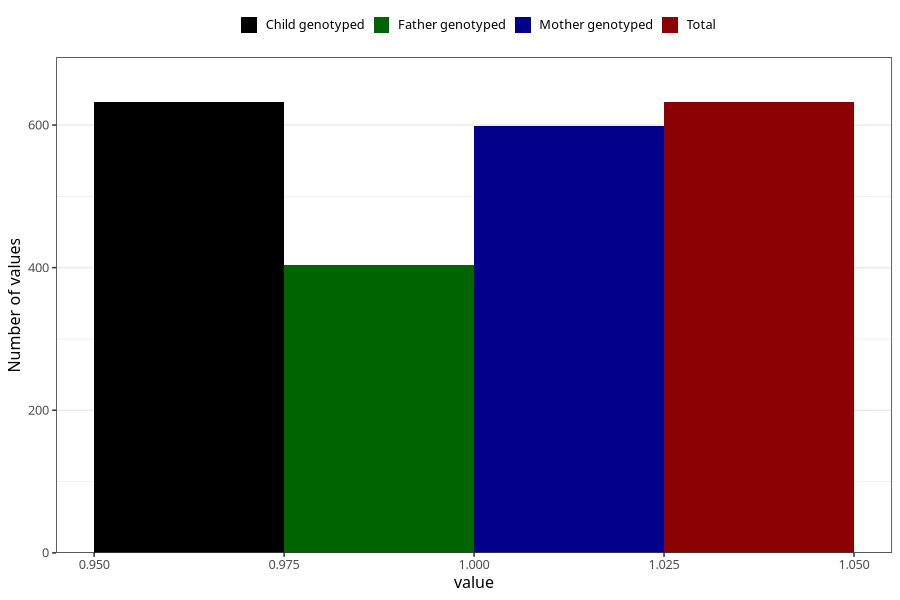

# throat_infection_5w_8w
Variable mapping to `AA357` in `Skjema1_v12`.
- Number of values:

| Value | Total | Child genotyped | Mother genotyped | Father genotyped |
| ----- | ----- | --------------- | ---------------- | ---------------- |
| Missing | 80373 | 80373 | 76019 | 53200 |
| Non-missing | 632 | 632 | 598 | 404 |
| 1 | 632 | 632 | 598 | 404 |

