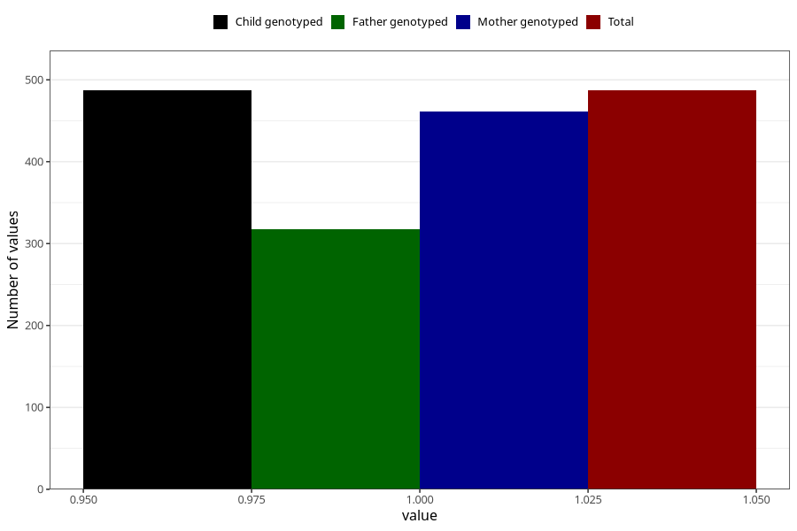

# throat_infection_before_4w
Variable mapping to `AA356` in `Skjema1_v12`.
- Number of values:

| Value | Total | Child genotyped | Mother genotyped | Father genotyped |
| ----- | ----- | --------------- | ---------------- | ---------------- |
| Missing | 80518 | 80518 | 76156 | 53286 |
| Non-missing | 487 | 487 | 461 | 318 |
| 1 | 487 | 487 | 461 | 318 |

