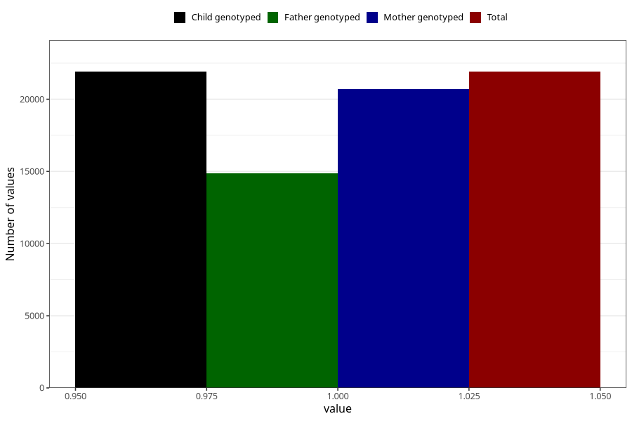

# unusual_tiredness_13w_15w
Variable mapping to `AA289` in `Skjema1_v12`.
- Number of values:

| Value | Total | Child genotyped | Mother genotyped | Father genotyped |
| ----- | ----- | --------------- | ---------------- | ---------------- |
| Missing | 59098 | 59098 | 55911 | 38747 |
| Non-missing | 21907 | 21907 | 20706 | 14857 |
| 1 | 21907 | 21907 | 20706 | 14857 |

