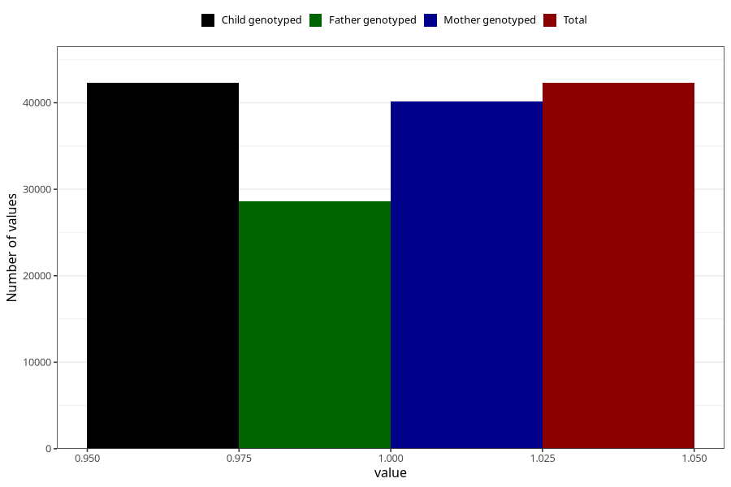

# unusual_tiredness_5w_8w
Variable mapping to `AA287` in `Skjema1_v12`.
- Number of values:

| Value | Total | Child genotyped | Mother genotyped | Father genotyped |
| ----- | ----- | --------------- | ---------------- | ---------------- |
| Missing | 38717 | 38717 | 36513 | 24954 |
| Non-missing | 42288 | 42288 | 40104 | 28650 |
| 1 | 42288 | 42288 | 40104 | 28650 |

