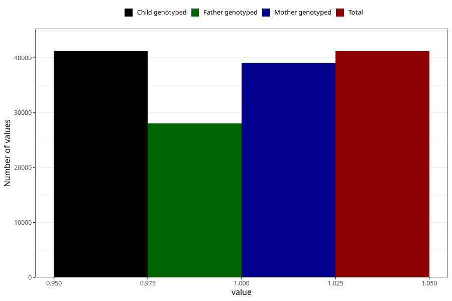

# unusual_tiredness_9w_12w
Variable mapping to `AA288` in `Skjema1_v12`.
- Number of values:

| Value | Total | Child genotyped | Mother genotyped | Father genotyped |
| ----- | ----- | --------------- | ---------------- | ---------------- |
| Missing | 39820 | 39820 | 37548 | 25563 |
| Non-missing | 41185 | 41185 | 39069 | 28041 |
| 1 | 41185 | 41185 | 39069 | 28041 |

