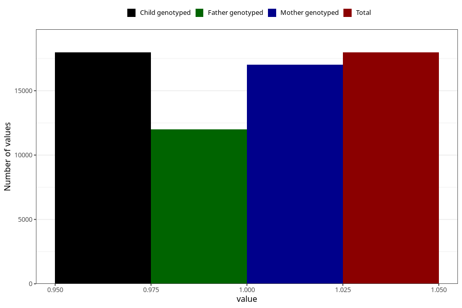

# unusual_tiredness_before_4w
Variable mapping to `AA286` in `Skjema1_v12`.
- Number of values:

| Value | Total | Child genotyped | Mother genotyped | Father genotyped |
| ----- | ----- | --------------- | ---------------- | ---------------- |
| Missing | 63035 | 63035 | 59612 | 41599 |
| Non-missing | 17970 | 17970 | 17005 | 12005 |
| 1 | 17970 | 17970 | 17005 | 12005 |

