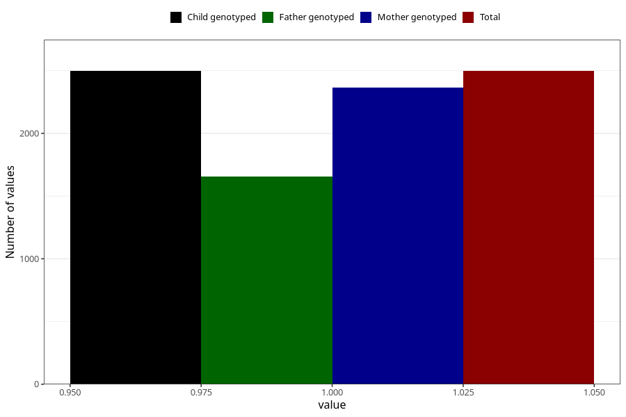

# vaginal_bleeding_1_13w_16w
Variable mapping to `CC317` in `Skjema3_v12`.
- Number of values:

| Value | Total | Child genotyped | Mother genotyped | Father genotyped |
| ----- | ----- | --------------- | ---------------- | ---------------- |
| Missing | 78508 | 78508 | 74252 | 51948 |
| Non-missing | 2497 | 2497 | 2365 | 1656 |
| 1 | 2497 | 2497 | 2365 | 1656 |

