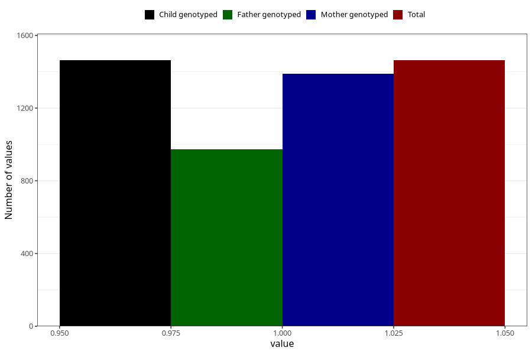

# vaginal_bleeding_1_17w_20w
Variable mapping to `CC318` in `Skjema3_v12`.
- Number of values:

| Value | Total | Child genotyped | Mother genotyped | Father genotyped |
| ----- | ----- | --------------- | ---------------- | ---------------- |
| Missing | 79542 | 79542 | 75229 | 52629 |
| Non-missing | 1463 | 1463 | 1388 | 975 |
| 1 | 1463 | 1463 | 1388 | 975 |

