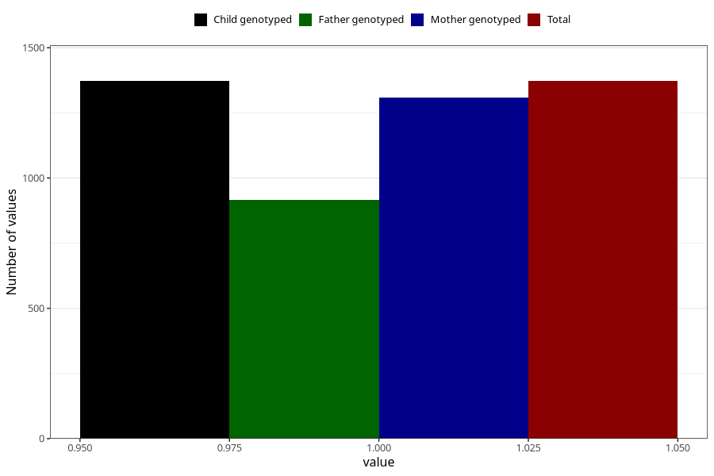

# vaginal_bleeding_1_21w_24w
Variable mapping to `CC319` in `Skjema3_v12`.
- Number of values:

| Value | Total | Child genotyped | Mother genotyped | Father genotyped |
| ----- | ----- | --------------- | ---------------- | ---------------- |
| Missing | 79633 | 79633 | 75308 | 52688 |
| Non-missing | 1372 | 1372 | 1309 | 916 |
| 1 | 1372 | 1372 | 1309 | 916 |

