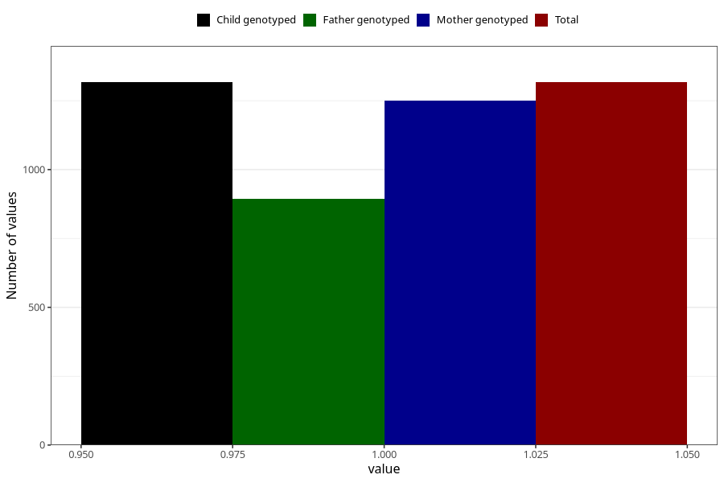

# vaginal_bleeding_1_25w_28w
Variable mapping to `CC320` in `Skjema3_v12`.
- Number of values:

| Value | Total | Child genotyped | Mother genotyped | Father genotyped |
| ----- | ----- | --------------- | ---------------- | ---------------- |
| Missing | 79688 | 79688 | 75367 | 52711 |
| Non-missing | 1317 | 1317 | 1250 | 893 |
| 1 | 1317 | 1317 | 1250 | 893 |

