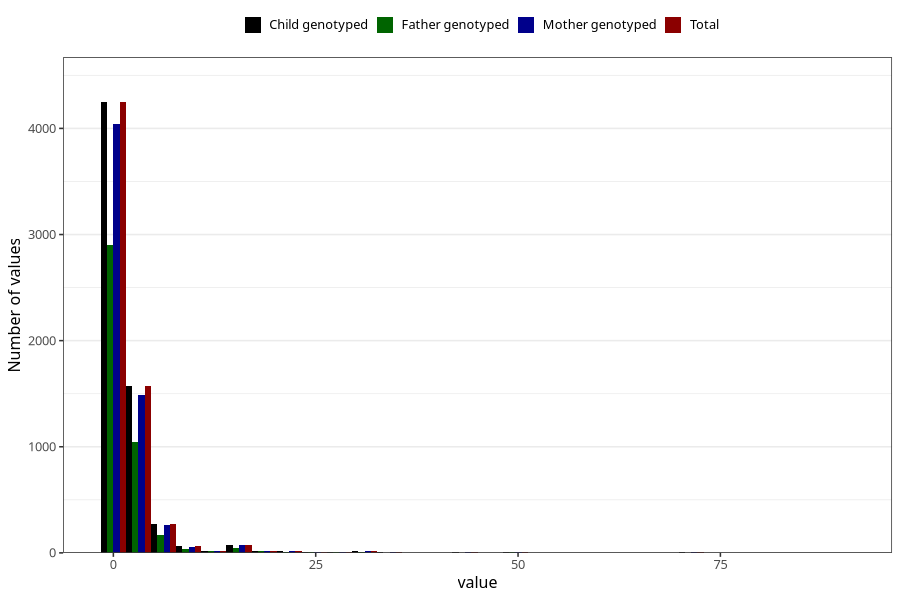

# vaginal_bleeding_1_duration
Variable mapping to `CC322` in `Skjema3_v12`.
- Number of values:

| Value | Total | Child genotyped | Mother genotyped | Father genotyped |
| ----- | ----- | --------------- | ---------------- | ---------------- |
| Missing | 74639 | 74639 | 70573 | 49325 |
| Non-missing | 6366 | 6366 | 6044 | 4279 |
| 25th percentile | 1 | 1 | 1 | 1 |
| 50th percentile | 1 | 1 | 1 | 1 |
| 75th percentile | 2 | 2 | 2 | 2 |
| Mean | 2.40135092679862 | 2.40135092679862 | 2.39576439444077 | 2.26454779154008 |
| Standard deviation | 5.19419502531832 | 5.19419502531832 | 5.1957755273759 | 4.72741133485688 |
| N | 6366 | 6366 | 6044 | 4279 |

