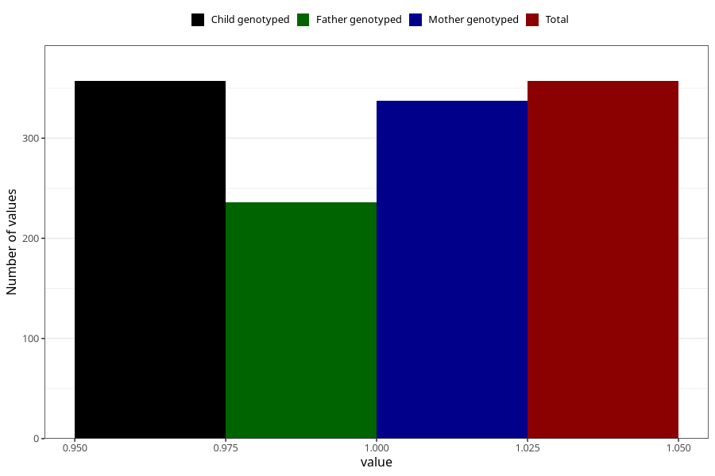

# vaginal_bleeding_2_13w_16w
Variable mapping to `CC324` in `Skjema3_v12`.
- Number of values:

| Value | Total | Child genotyped | Mother genotyped | Father genotyped |
| ----- | ----- | --------------- | ---------------- | ---------------- |
| Missing | 80648 | 80648 | 76280 | 53368 |
| Non-missing | 357 | 357 | 337 | 236 |
| 1 | 357 | 357 | 337 | 236 |

