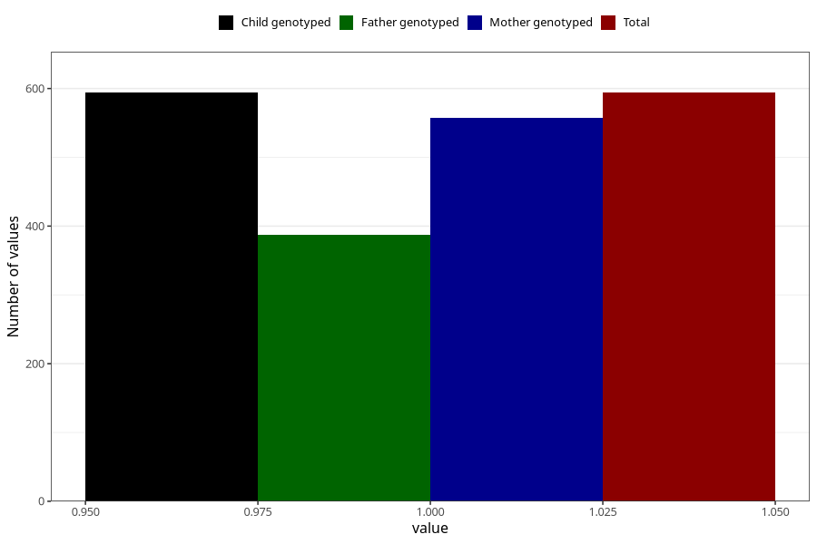

# vaginal_bleeding_2_25w_28w
Variable mapping to `CC327` in `Skjema3_v12`.
- Number of values:

| Value | Total | Child genotyped | Mother genotyped | Father genotyped |
| ----- | ----- | --------------- | ---------------- | ---------------- |
| Missing | 80411 | 80411 | 76060 | 53217 |
| Non-missing | 594 | 594 | 557 | 387 |
| 1 | 594 | 594 | 557 | 387 |

