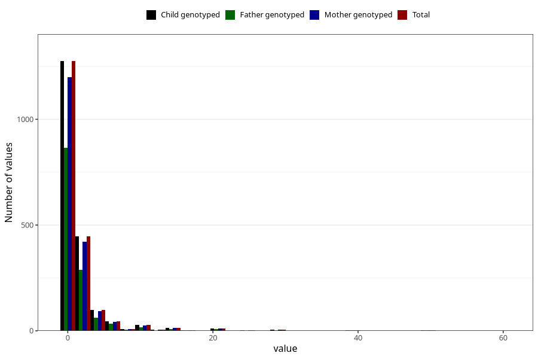

# vaginal_bleeding_2_duration
Variable mapping to `CC329` in `Skjema3_v12`.
- Number of values:

| Value | Total | Child genotyped | Mother genotyped | Father genotyped |
| ----- | ----- | --------------- | ---------------- | ---------------- |
| Missing | 79054 | 79054 | 74779 | 52300 |
| Non-missing | 1951 | 1951 | 1838 | 1304 |
| 25th percentile | 1 | 1 | 1 | 1 |
| 50th percentile | 1 | 1 | 1 | 1 |
| 75th percentile | 2 | 2 | 2 | 2 |
| Mean | 2.30138390568939 | 2.30138390568939 | 2.32916213275299 | 2.22546012269939 |
| Standard deviation | 4.20114674598005 | 4.20114674598005 | 4.2947890917057 | 3.93419730827259 |
| N | 1951 | 1951 | 1838 | 1304 |

