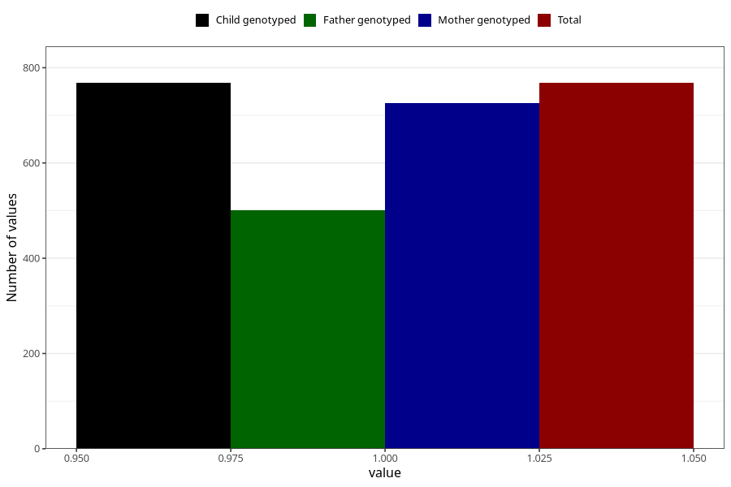

# vaginal_bleeding_know_why_cervical_ulcer_mucous_bleeding
Variable mapping to `CC336` in `Skjema3_v12`.
- Number of values:

| Value | Total | Child genotyped | Mother genotyped | Father genotyped |
| ----- | ----- | --------------- | ---------------- | ---------------- |
| Missing | 80237 | 80237 | 75892 | 53104 |
| Non-missing | 768 | 768 | 725 | 500 |
| 1 | 768 | 768 | 725 | 500 |

