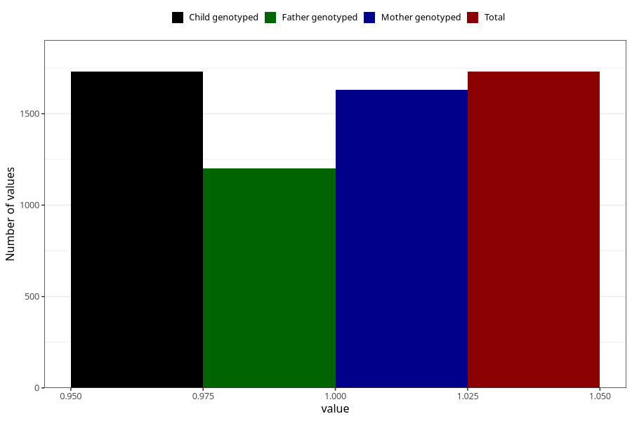

# vaginal_bleeding_know_why_intercourse
Variable mapping to `CC337` in `Skjema3_v12`.
- Number of values:

| Value | Total | Child genotyped | Mother genotyped | Father genotyped |
| ----- | ----- | --------------- | ---------------- | ---------------- |
| Missing | 79275 | 79275 | 74985 | 52402 |
| Non-missing | 1730 | 1730 | 1632 | 1202 |
| 1 | 1730 | 1730 | 1632 | 1202 |

