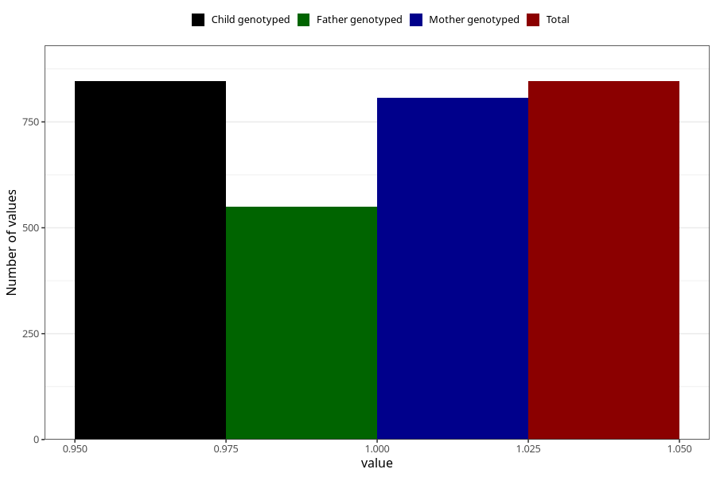

# vaginal_bleeding_know_why_placenta_position
Variable mapping to `CC333` in `Skjema3_v12`.
- Number of values:

| Value | Total | Child genotyped | Mother genotyped | Father genotyped |
| ----- | ----- | --------------- | ---------------- | ---------------- |
| Missing | 80159 | 80159 | 75810 | 53055 |
| Non-missing | 846 | 846 | 807 | 549 |
| 1 | 846 | 846 | 807 | 549 |

