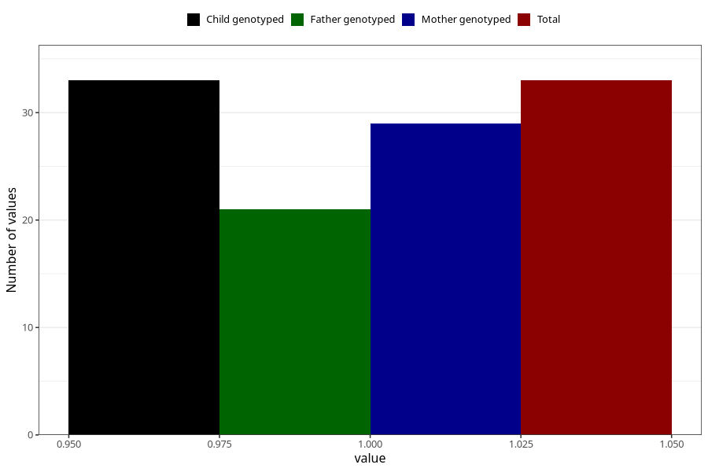

# vaginal_bleeding_know_why_placenta_separation
Variable mapping to `CC334` in `Skjema3_v12`.
- Number of values:

| Value | Total | Child genotyped | Mother genotyped | Father genotyped |
| ----- | ----- | --------------- | ---------------- | ---------------- |
| Missing | 80972 | 80972 | 76588 | 53583 |
| Non-missing | 33 | 33 | 29 | 21 |
| 1 | 33 | 33 | 29 | 21 |

