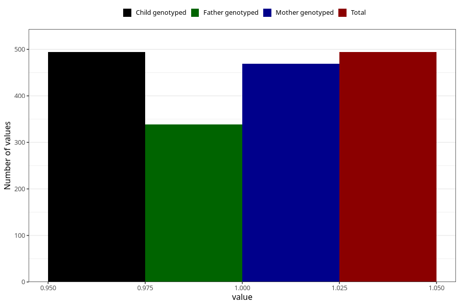

# vaginal_bleeding_more_than_two_episodes
Variable mapping to `CC330` in `Skjema3_v12`.
- Number of values:

| Value | Total | Child genotyped | Mother genotyped | Father genotyped |
| ----- | ----- | --------------- | ---------------- | ---------------- |
| Missing | 80511 | 80511 | 76148 | 53265 |
| Non-missing | 494 | 494 | 469 | 339 |
| 1 | 494 | 494 | 469 | 339 |

