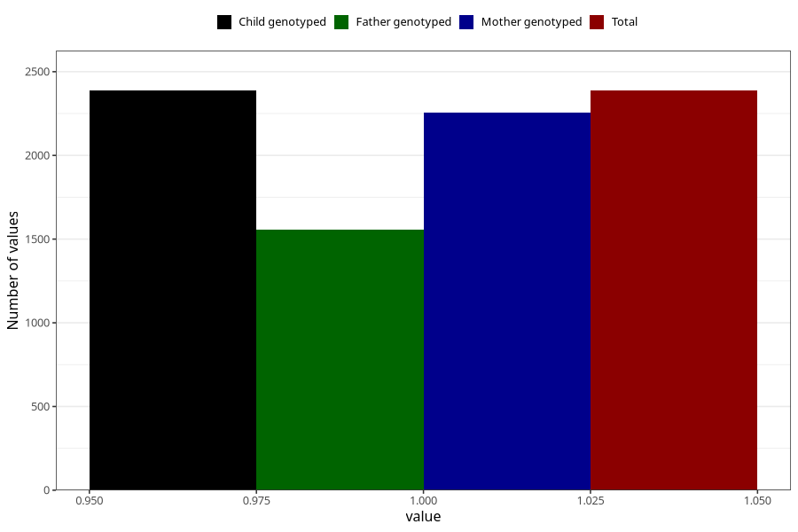

# vaginal_catarrh_unusual_discharge_13w_15w
Variable mapping to `AA249` in `Skjema1_v12`.
- Number of values:

| Value | Total | Child genotyped | Mother genotyped | Father genotyped |
| ----- | ----- | --------------- | ---------------- | ---------------- |
| Missing | 78618 | 78618 | 74362 | 52046 |
| Non-missing | 2387 | 2387 | 2255 | 1558 |
| 1 | 2387 | 2387 | 2255 | 1558 |

