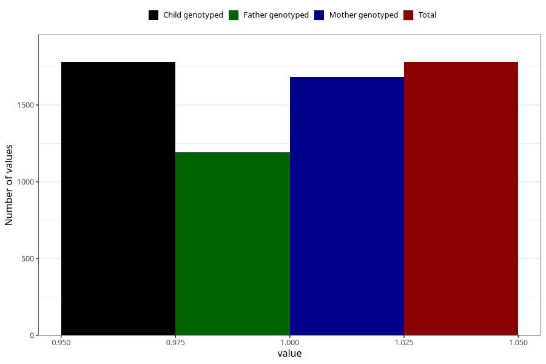

# vaginal_catarrh_unusual_discharge_21w_24w
Variable mapping to `CC414` in `Skjema3_v12`.
- Number of values:

| Value | Total | Child genotyped | Mother genotyped | Father genotyped |
| ----- | ----- | --------------- | ---------------- | ---------------- |
| Missing | 79225 | 79225 | 74935 | 52410 |
| Non-missing | 1780 | 1780 | 1682 | 1194 |
| 1 | 1780 | 1780 | 1682 | 1194 |

