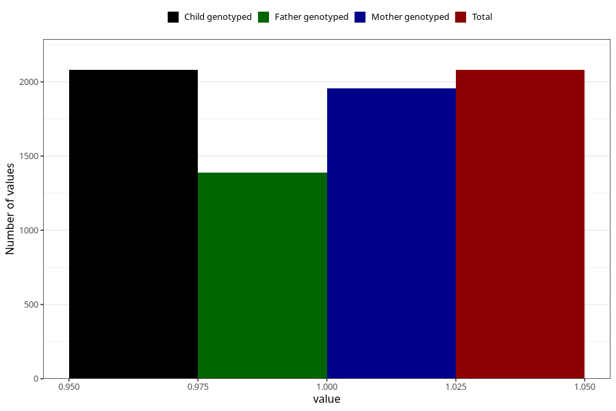

# vaginal_catarrh_unusual_discharge_25w_28w
Variable mapping to `CC415` in `Skjema3_v12`.
- Number of values:

| Value | Total | Child genotyped | Mother genotyped | Father genotyped |
| ----- | ----- | --------------- | ---------------- | ---------------- |
| Missing | 78925 | 78925 | 74659 | 52214 |
| Non-missing | 2080 | 2080 | 1958 | 1390 |
| 1 | 2080 | 2080 | 1958 | 1390 |

