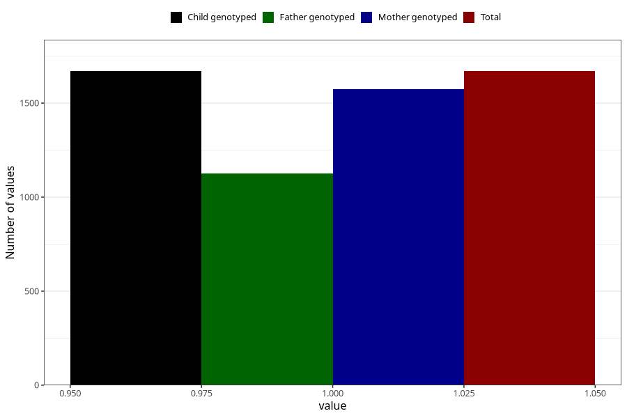

# vaginal_catarrh_unusual_discharge_after_29w
Variable mapping to `CC416` in `Skjema3_v12`.
- Number of values:

| Value | Total | Child genotyped | Mother genotyped | Father genotyped |
| ----- | ----- | --------------- | ---------------- | ---------------- |
| Missing | 79335 | 79335 | 75044 | 52477 |
| Non-missing | 1670 | 1670 | 1573 | 1127 |
| 1 | 1670 | 1670 | 1573 | 1127 |

