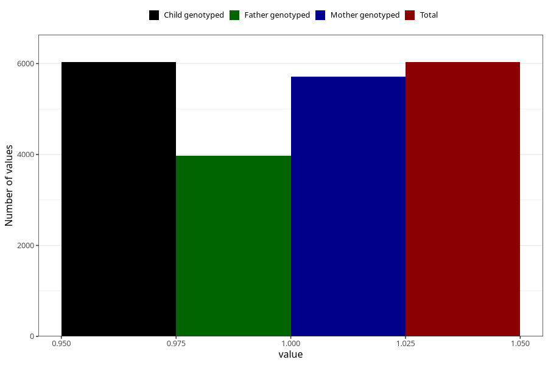

# vaginal_thrush_13w_15w
Variable mapping to `AA239` in `Skjema1_v12`.
- Number of values:

| Value | Total | Child genotyped | Mother genotyped | Father genotyped |
| ----- | ----- | --------------- | ---------------- | ---------------- |
| Missing | 74974 | 74974 | 70911 | 49630 |
| Non-missing | 6031 | 6031 | 5706 | 3974 |
| 1 | 6031 | 6031 | 5706 | 3974 |

