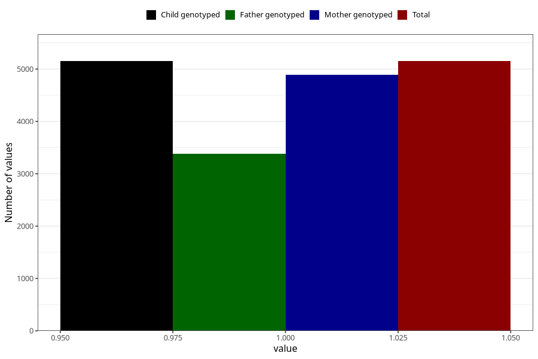

# vaginal_thrush_17w_20w
Variable mapping to `CC401` in `Skjema3_v12`.
- Number of values:

| Value | Total | Child genotyped | Mother genotyped | Father genotyped |
| ----- | ----- | --------------- | ---------------- | ---------------- |
| Missing | 75854 | 75854 | 71730 | 50223 |
| Non-missing | 5151 | 5151 | 4887 | 3381 |
| 1 | 5151 | 5151 | 4887 | 3381 |

