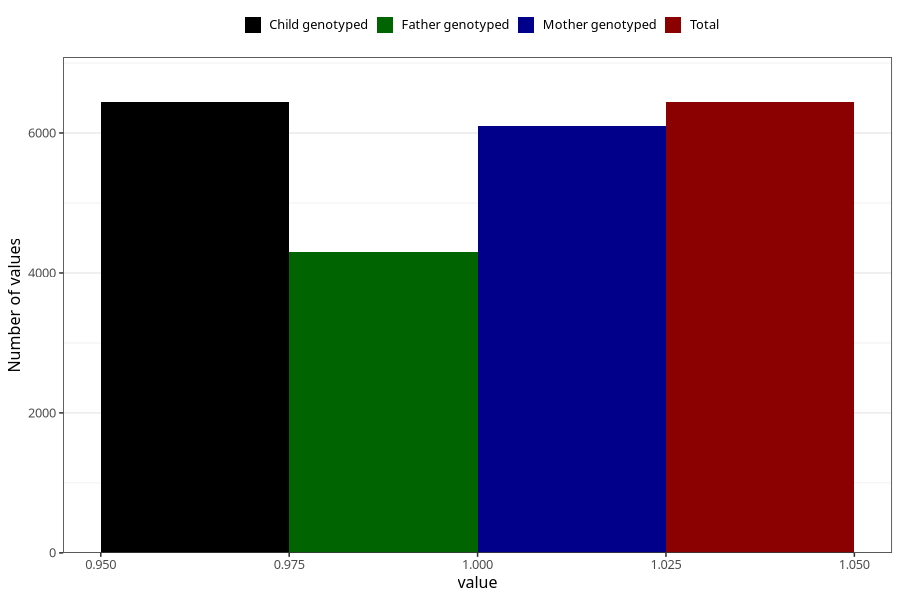

# vaginal_thrush_25w_28w
Variable mapping to `CC403` in `Skjema3_v12`.
- Number of values:

| Value | Total | Child genotyped | Mother genotyped | Father genotyped |
| ----- | ----- | --------------- | ---------------- | ---------------- |
| Missing | 74565 | 74565 | 70511 | 49309 |
| Non-missing | 6440 | 6440 | 6106 | 4295 |
| 1 | 6440 | 6440 | 6106 | 4295 |

