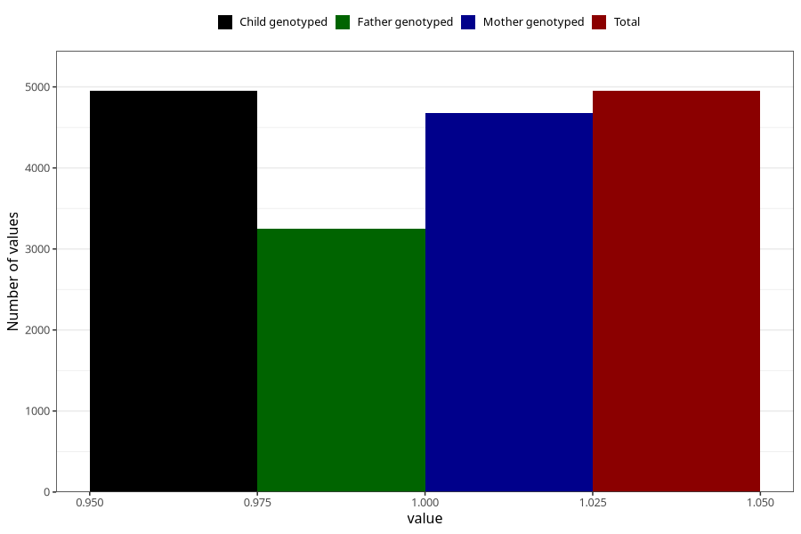

# vaginal_thrush_5w_8w
Variable mapping to `AA237` in `Skjema1_v12`.
- Number of values:

| Value | Total | Child genotyped | Mother genotyped | Father genotyped |
| ----- | ----- | --------------- | ---------------- | ---------------- |
| Missing | 76055 | 76055 | 71934 | 50355 |
| Non-missing | 4950 | 4950 | 4683 | 3249 |
| 1 | 4950 | 4950 | 4683 | 3249 |

