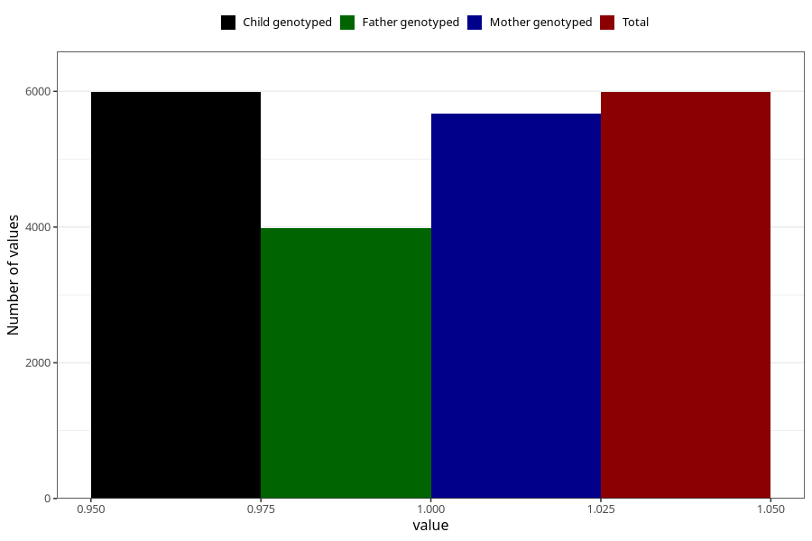

# vaginal_thrush_9w_12w
Variable mapping to `AA238` in `Skjema1_v12`.
- Number of values:

| Value | Total | Child genotyped | Mother genotyped | Father genotyped |
| ----- | ----- | --------------- | ---------------- | ---------------- |
| Missing | 75017 | 75017 | 70946 | 49621 |
| Non-missing | 5988 | 5988 | 5671 | 3983 |
| 1 | 5988 | 5988 | 5671 | 3983 |

