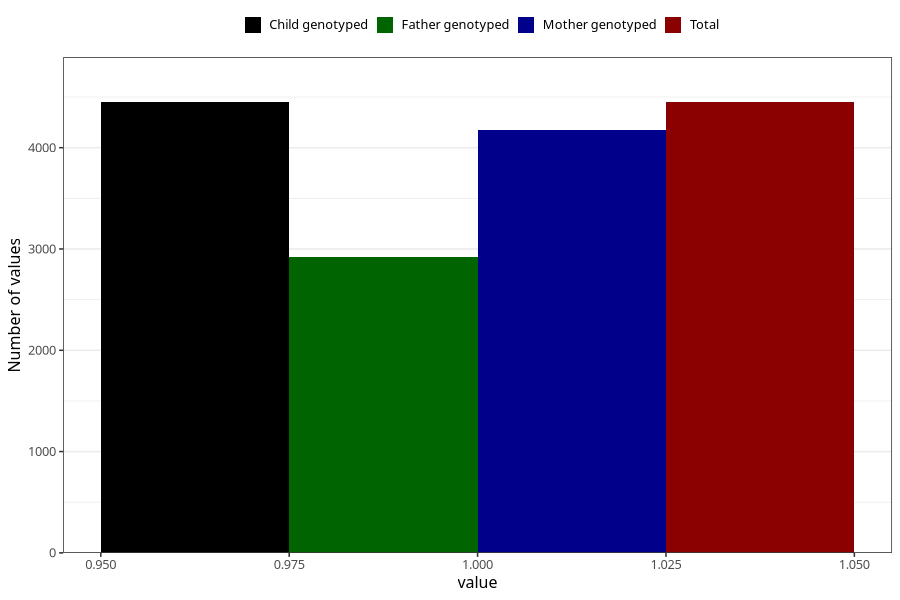

# vaginal_thrush_after_29w
Variable mapping to `CC404` in `Skjema3_v12`.
- Number of values:

| Value | Total | Child genotyped | Mother genotyped | Father genotyped |
| ----- | ----- | --------------- | ---------------- | ---------------- |
| Missing | 76556 | 76556 | 72440 | 50682 |
| Non-missing | 4449 | 4449 | 4177 | 2922 |
| 1 | 4449 | 4449 | 4177 | 2922 |

