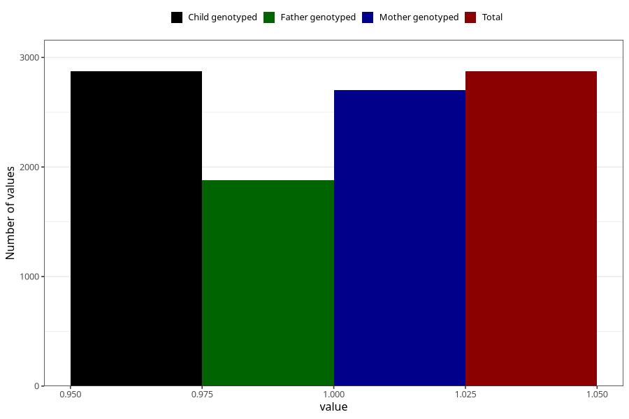

# vaginal_thrush_before_4w
Variable mapping to `AA236` in `Skjema1_v12`.
- Number of values:

| Value | Total | Child genotyped | Mother genotyped | Father genotyped |
| ----- | ----- | --------------- | ---------------- | ---------------- |
| Missing | 78132 | 78132 | 73912 | 51726 |
| Non-missing | 2873 | 2873 | 2705 | 1878 |
| 1 | 2873 | 2873 | 2705 | 1878 |

