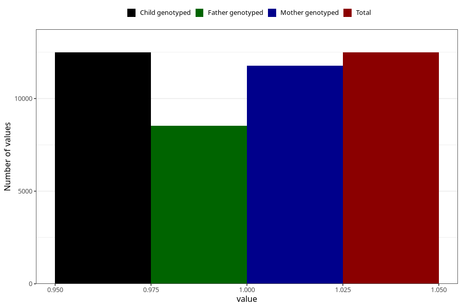

# vomiting_13w_15w
Variable mapping to `AA229` in `Skjema1_v12`.
- Number of values:

| Value | Total | Child genotyped | Mother genotyped | Father genotyped |
| ----- | ----- | --------------- | ---------------- | ---------------- |
| Missing | 68517 | 68517 | 64843 | 45078 |
| Non-missing | 12488 | 12488 | 11774 | 8526 |
| 1 | 12488 | 12488 | 11774 | 8526 |

