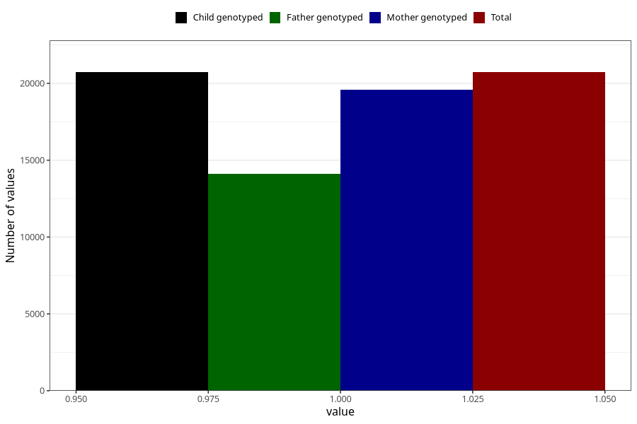

# vomiting_9w_12w
Variable mapping to `AA228` in `Skjema1_v12`.
- Number of values:

| Value | Total | Child genotyped | Mother genotyped | Father genotyped |
| ----- | ----- | --------------- | ---------------- | ---------------- |
| Missing | 60279 | 60279 | 57019 | 39496 |
| Non-missing | 20726 | 20726 | 19598 | 14108 |
| 1 | 20726 | 20726 | 19598 | 14108 |

