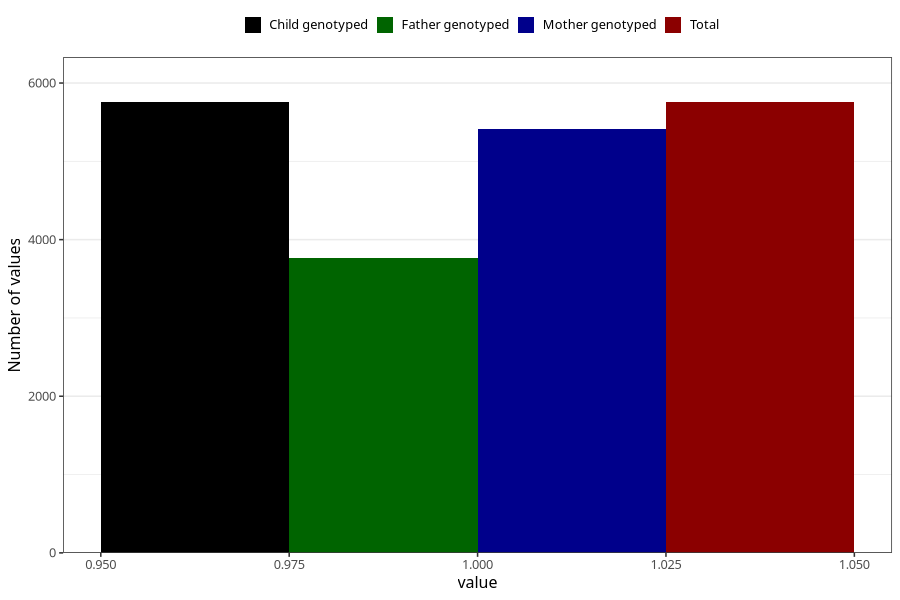

# vomiting_before_4w
Variable mapping to `AA226` in `Skjema1_v12`.
- Number of values:

| Value | Total | Child genotyped | Mother genotyped | Father genotyped |
| ----- | ----- | --------------- | ---------------- | ---------------- |
| Missing | 75250 | 75250 | 71199 | 49835 |
| Non-missing | 5755 | 5755 | 5418 | 3769 |
| 1 | 5755 | 5755 | 5418 | 3769 |

