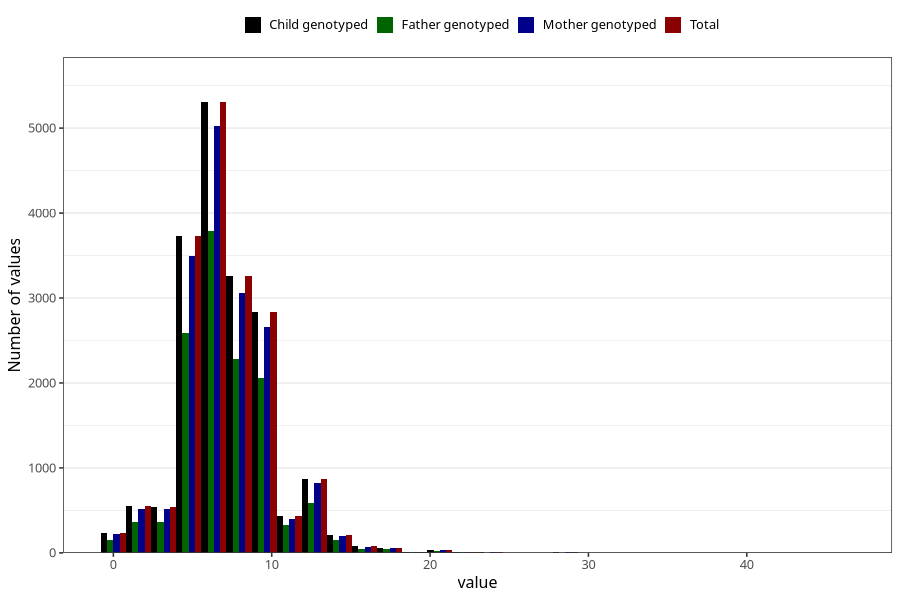

# vomiting_week_from_q2
Variable mapping to `BB857` in `Skjema2CDW_v12`.
- Number of values:

| Value | Total | Child genotyped | Mother genotyped | Father genotyped |
| ----- | ----- | --------------- | ---------------- | ---------------- |
| Missing | 62795 | 62795 | 59478 | 40800 |
| Non-missing | 18210 | 18210 | 17139 | 12804 |
| 25th percentile | 5 | 5 | 5 | 5 |
| 50th percentile | 7 | 7 | 7 | 7 |
| 75th percentile | 9 | 9 | 9 | 9 |
| Mean | 7.09719934102142 | 7.09719934102142 | 7.09743859034949 | 7.13081849422056 |
| Standard deviation | 3.04079171513614 | 3.04079171513614 | 3.04021819719429 | 2.98427076265901 |
| N | 18210 | 18210 | 17139 | 12804 |

