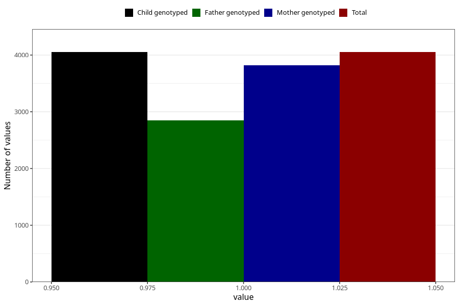

# vomiting_week_still_q2
Variable mapping to `BB859` in `Skjema2CDW_v12`.
- Number of values:

| Value | Total | Child genotyped | Mother genotyped | Father genotyped |
| ----- | ----- | --------------- | ---------------- | ---------------- |
| Missing | 76953 | 76953 | 72800 | 50757 |
| Non-missing | 4052 | 4052 | 3817 | 2847 |
| 1 | 4052 | 4052 | 3817 | 2847 |

